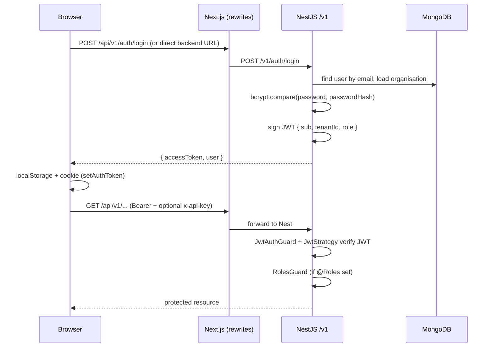

# Login and authentication

This document describes how sign-in works end-to-end in Plutus: the **Next.js** app (`plutus-fe`) and the **NestJS** API (`plutus-be`). It complements [`integration.md`](./integration.md) and [`backend-auth-database.md`](./backend-auth-database.md).

## Contents

1. [Overview](#overview)
2. [Frontend (`plutus-fe`)](#frontend-plutus-fe)
3. [Backend (`plutus-be`)](#backend-plutus-be)
4. [Environment variables](#environment-variables-auth-related)
5. [Logout](#logout)

---

## Overview

- **Credentials**: Email and password are sent to the backend; the API never returns the password hash.
- **Session**: The API issues a **JWT access token**. The browser keeps it in **`localStorage`** (key `plutus_access_token`) and mirrors it in a **first-party cookie** (`plutus_access_token`) for optional server-side checks.
- **API access**: Authenticated requests send **`Authorization: Bearer <token>`**. The Nest app verifies the JWT and exposes **`req.user`** (`userId`, `tenantId`, `role`).
- **Authorization**: **`JwtAuthGuard`** ensures the user is authenticated (unless the route is **`@Public()`**). **`RolesGuard`** then checks **`@Roles(...)`** when present; routes without `@Roles` allow any authenticated role (subject to service logic).

---

## Frontend (`plutus-fe`)

### Login page

[`src/app/login/page.tsx`](../src/app/login/page.tsx) submits email and password via **`ApiHelper`**:

- Endpoint: `auth/login` (resolved against `NEXT_PUBLIC_BACKEND_API_URL` / `BACKEND_API_URL`, which should end with `/v1`).
- **`includeKey = false`** so the optional **`BACKEND_API_KEY`** header is not sent on this call (auth is public).
- On success, the response must include **`accessToken`**; otherwise a generic “Invalid email or password” message is shown.
- **`setAuthToken(accessToken)`** persists the token, then **`window.location.assign('/dashboard')`** performs a **full page navigation** so the cookie is visible immediately on the next request (avoids a race where client-side routing hits the Next.js layer before the new cookie is set).

### Token storage and clearing

[`src/lib/api-helper.ts`](../src/lib/api-helper.ts):

| Mechanism | Purpose |
|-----------|---------|
| **`localStorage`** (`plutus_access_token`) | Primary store; **`getStoredToken()`** reads it for **`ApiHelper`** and **`authFetcher`**. |
| **Cookie** `plutus_access_token` | Same value, `path=/`, `SameSite=Lax`, `max-age` default 7 days (aligned with typical JWT lifetime). Intended for server-side or edge checks if you wire middleware. |
| **`clearAuthToken()`** | Removes the localStorage entry and expires the cookie (e.g. logout on [Settings](../src/app/dashboard/settings/page.tsx)). |

### Sending the token on API calls

- **`ApiHelper.fetchRequest` / `fetchMultipart`**: If `getStoredToken()` returns a value, sets **`Authorization: Bearer ...`**. When `includeKey` is true (default), also adds **`x-api-key`** if `BACKEND_API_KEY` is set (frontend convention; the current Nest API does not require it).
- **`authFetcher`** ([`src/lib/swr-fetcher.ts`](../src/lib/swr-fetcher.ts)): Same Bearer header for SWR data loads. Uses **`resolveApiBaseUrl()`** ([`src/lib/resolve-api-base-url.ts`](../src/lib/resolve-api-base-url.ts)) so browser calls can use same-origin **`/api/v1`** when configured.

### Client-only JWT read (not verified)

[`src/lib/jwt.ts`](../src/lib/jwt.ts) exposes **`getJwtSubject(token)`**, which base64-decodes the payload **without verifying the signature** to read **`sub`** (user id) for UI (e.g. Settings loads `users/id/:id`). **Authorization decisions belong on the server**; this is convenience only.

### Routing the browser to the API

[`next.config.js`](../next.config.js) rewrites **`/api/v1/:path*`** to the backend base URL (from `BACKEND_API_URL` / `INTERNAL_BACKEND_URL`, default `http://localhost:3001/v1`). The SPA can call same-origin URLs like `/api/v1/auth/login` while Nest still serves versioned routes under **`/v1`**.

### Optional server-side route guard

[`src/proxy.ts`](../src/proxy.ts) implements cookie-based checks for **`/dashboard`** (redirect to `/login` if `plutus_access_token` is missing). It is **not** wired as Next.js **`middleware.ts`** in this repo. To enforce dashboard access on the server, export this logic from a root `middleware.ts` per [Next.js middleware conventions](https://nextjs.org/docs/app/building-your-application/routing/middleware).

---

## Backend (`plutus-be`)

### Versioning and public routes

- HTTP routes are under **`/v1`** (URI versioning in `plutus-be/src/main.ts`).
- **`JwtAuthGuard`** is registered **globally** in `plutus-be/src/app.module.ts`. Handlers opt out with **`@Public()`** (`plutus-be/src/auth/public.decorator.ts`).
- **`RolesGuard`** is also global. It only restricts access when the handler declares **`@Roles(...)`**; otherwise any authenticated user passes.
- Public examples: **`POST /v1/auth/login`**, **`POST /v1/auth/register`**, and **`AppController`** root/health (`plutus-be/src/app.controller.ts`).

### Login

`AuthController` → `AuthService.login` (`plutus-be/src/auth/auth.controller.ts`, `auth.service.ts`):

1. Normalize email (`toLowerCase`, trim).
2. Load **User** by email with **`organisationId`** populated.
3. Reject if no **`passwordHash`** or **bcrypt** comparison fails (same error: invalid credentials).
4. Ensure organisation has **`tenantId`**.
5. Build JWT payload **`{ sub, tenantId, role }`** and sign with **`JwtService`** (`plutus-be/src/auth/auth.module.ts`: secret **`JWT_SECRET`**, expiry **`JWT_EXPIRES_IN`**, default **`7d`**).
6. Return **`accessToken`** and a small **`user`** object (id, email, name, role, tenantId).

### JWT validation (`passport-jwt`)

`JwtStrategy` (`plutus-be/src/auth/jwt.strategy.ts`):

- Extracts the token with **`ExtractJwt.fromAuthHeaderAsBearerToken()`**.
- Verifies signature and expiration using **`JWT_SECRET`**.
- **`validate`** maps the payload to **`req.user`**: **`userId`**, **`tenantId`**, **`role`**. Missing **`sub`**, **`tenantId`**, or **`role`** yields **401**.

### Role-based access

- Handlers declare **`@Roles('admin', 'editor', ...)`** via `plutus-be/src/auth/roles.decorator.ts`.
- If **no** `@Roles` metadata: **`RolesGuard`** allows the request (user must still pass **`JwtAuthGuard`**).
- If **`@Roles`** is set: **`req.user.role`** must be in the list or the API returns **403** (`plutus-be/src/auth/roles.guard.ts`).

### Registration (related, not login)

`POST /v1/auth/register` (`plutus-be/src/auth/auth.service.ts`) creates an **Organisation** (unique **`tenantId`** slug from the org name), hashes the password, and creates the first user with role **`admin`**. It does **not** return a JWT; the client should call **`/auth/login`** afterward.

---

## Environment variables (auth-related)

| Variable | Where | Role |
|----------|--------|------|
| `JWT_SECRET` | `plutus-be` | Sign and verify JWTs |
| `JWT_EXPIRES_IN` | `plutus-be` | Access token lifetime (e.g. `7d`) |
| `NEXT_PUBLIC_BACKEND_API_URL` / `BACKEND_API_URL` | `plutus-fe` | API base URL including `/v1` |
| `BACKEND_API_URL` / `INTERNAL_BACKEND_URL` | `plutus-fe` (`next.config`) | Target for `/api/v1` rewrites |
| `BACKEND_API_KEY` | `plutus-fe` | Optional `x-api-key` on `ApiHelper` requests when enabled |

---

## Logout

There is no server-side session store to invalidate. **Logout is client-side**: **`clearAuthToken()`** and navigation to **`/login`** (see Settings). Until the JWT expires, anyone who possesses the token can call the API; treat the token as a bearer secret.

---

## References

- [`src/lib/api-helper.ts`](../src/lib/api-helper.ts) — `setAuthToken`, `clearAuthToken`, `getStoredToken`, `ApiHelper`
- [`src/app/login/page.tsx`](../src/app/login/page.tsx) — login form
- [`plutus-be/src/auth/`](../../plutus-be/src/auth/) — Nest auth module, guards, strategy
- [`docs/integration.md`](./integration.md) — request path from UI to backend
