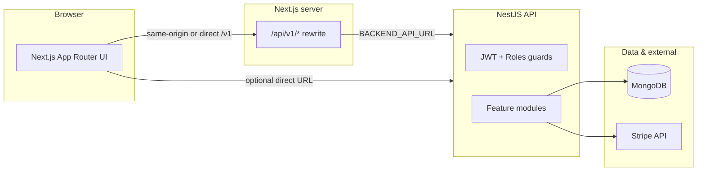

# System architecture

## Overview

Allatura is a **multi-tenant** SaaS-style app for tracking **IT systems**, **vendor contracts**, **renewal workflows**, and **spend analytics**. Users belong to an **organisation** identified by a stable string **`tenantId`**; all business data is scoped by that tenant.

## Repositories

| Repository | Role |
|------------|------|
| `plutus-fe` | Next.js 16 frontend: App Router pages, `ApiHelper` / SWR for HTTP, Tailwind + MUI/HeroUI |
| `plutus-be` | NestJS 11 REST API: Mongoose, JWT auth, scheduled renewal jobs, Swagger |

They are **separate git repositories**; deploy and version them independently, but keep **API contract** and **env URLs** aligned.

## API surface

- **Base path**: all HTTP routes are under **`/v1`** (Nest [URI versioning](https://docs.nestjs.com/techniques/versioning)).
- **Swagger**: served at **`/api`** on the backend (e.g. `http://localhost:3001/api`).
- **Health**: `GET /v1/health` and root meta on `GET /v1` (see `AppController`).

## Multi-tenancy model

1. **Organisation** (`organisations` collection): has `name` and unique `tenantId` (slug).
2. **User** (`users`): references `organisationId`; first user on register is **admin**.
3. **JWT payload** carries `sub` (user id), `tenantId`, and `role` (`admin` | `editor` | `viewer`).
4. Domain services (contracts, systems, renewals, analytics, audit) filter by **`req.user.tenantId`** from the JWT.

## Frontend networking

- **`NEXT_PUBLIC_BACKEND_API_URL`**: must include `/v1` (see `.env.example`).
- **Local dev**: for `localhost` API URLs, the app can use the **Next.js rewrite** `/api/v1` → backend so the browser stays same-origin and avoids CORS issues (`resolve-api-base-url.ts` + `next.config.js`).
- **Auth token**: stored as `plutus_access_token` in `localStorage` and mirrored to a cookie for server-side flows; sent as **`Authorization: Bearer <token>`**.

## Background processing

- **`@nestjs/schedule`**: daily cron (midnight) runs renewal logic (`RenewalCron` → `RenewalService.runDailyCron`).

## Optional integrations

- **Stripe**: dynamic module with API key from env; HTTP routes under `/v1/stripe` are marked **public** for session/subscription reads (see `StripeController`). Frontend has checkout/plan pages and Stripe env vars in `.env.example`.
