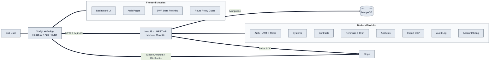

# 1) System Architecture Diagram

- Frontend is a Next.js web app using App Router, SWR, and authenticated `fetch`.
- Backend is a NestJS modular monolith exposing versioned REST APIs.
- Data is persisted in MongoDB via Mongoose schemas.
- Stripe is integrated for checkout, sessions, and subscription workflows.
- Communication is HTTP/HTTPS REST (no WebSocket or MQTT usage found).
