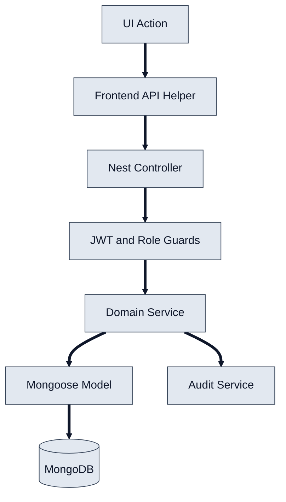

# 2) Detailed Technical Design (Current State)

- **Frontend modules:** auth pages, dashboard domains (systems, contracts, renewals, analytics, import, audit), and shared API helpers.
- **Backend modules:** `auth`, `user`, `account`, `system`, `contract`, `renewal`, `analytics`, `import`, `audit`, `stripe`.
- **Core pattern:** controller -> service -> Mongoose model, with guard-based security and audit logging on major mutations.
- **Architecture style:** modular monolith with tenant-aware filtering using `tenantId` from JWT claims.
- **Scheduling:** renewal processing includes cron-driven scanning and alert/decision lifecycle updates.

