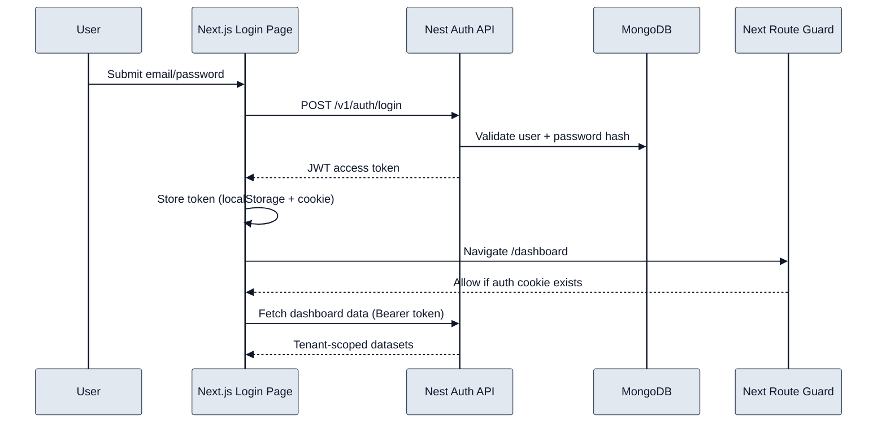
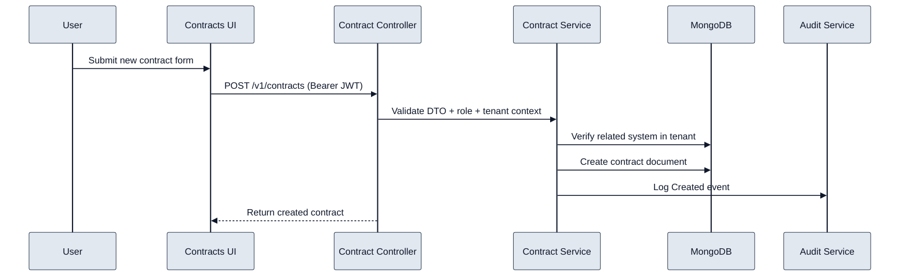

# 3) Code Flow (Critical User Journeys)

## Flow A: Login to Dashboard

- User credentials are validated in backend auth service.
- Access token is generated and persisted client-side.
- Protected dashboard APIs then use bearer auth with tenant-aware responses.

## Flow B: Create Contract

- Contract creation is guarded by role checks.
- Service-layer validation prevents invalid tenant cross-linking.
- Audit entries provide traceability for critical writes.
