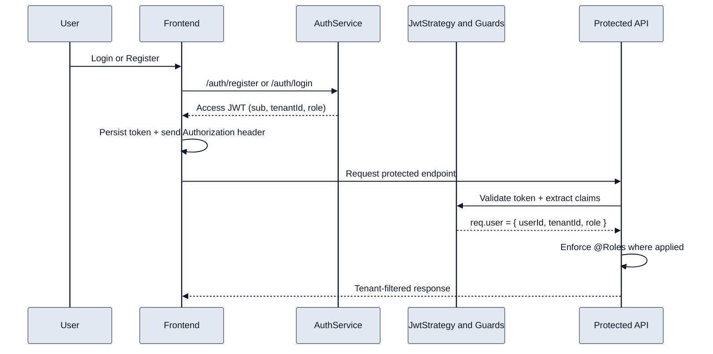

# 4) Authentication Flow

- Authentication uses JWT bearer tokens.
- Backend applies JWT guard globally and allows explicit `@Public` routes.
- Authorization uses role guards on selected mutation endpoints.
- Tenant isolation is achieved by carrying `tenantId` in JWT and scoping queries.
- Current implementation returns access token only (no refresh token lifecycle).
