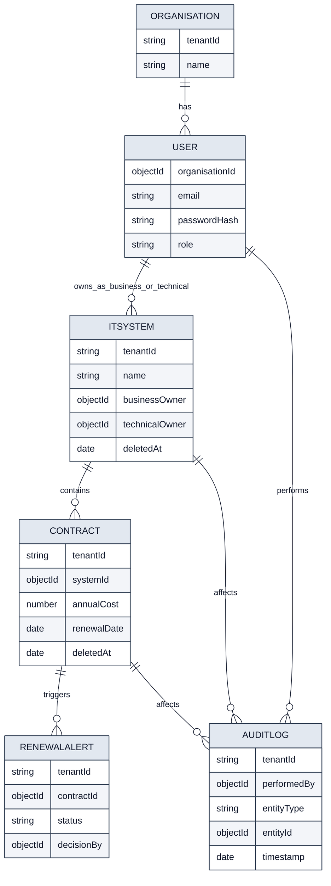

# 5) Database and Data Model

- Storage is MongoDB (NoSQL) via Mongoose schemas.
- Tenant-aware design is implemented through `tenantId` propagation.
- ObjectId references connect users, systems, contracts, and renewal lifecycle records.
- Soft deletion is used for key operational entities to preserve history.
- Audit logs capture actor, action, and before/after context for compliance traceability.
