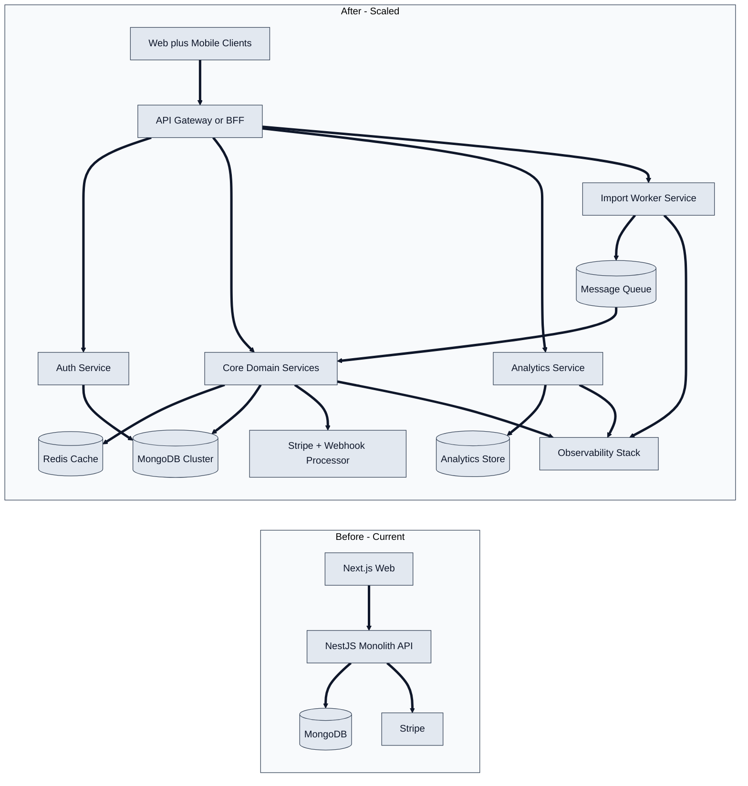

# 7) Future Architecture Vision (10x to 100x)

- **10x scale path:** add pagination, Redis caching, async queues for imports/renewals, and strict secret/config enforcement.
- **100x scale path:** split by domain boundaries (auth/core/analytics/import) behind an API gateway.
- **Workload isolation:** move heavy analytics and batch processing off latency-sensitive API paths.
- **Reliability:** add idempotent webhook processing, structured retries, and full observability pipelines.
- **Cloud fit:** maps cleanly to managed AWS/GCP/Azure services for autoscaling, queueing, caching, and monitoring.
